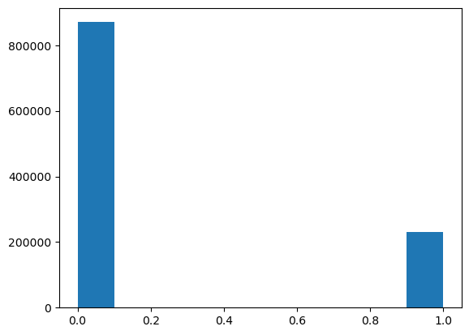
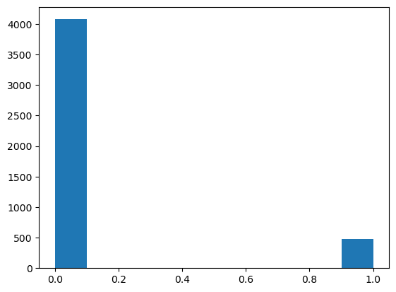
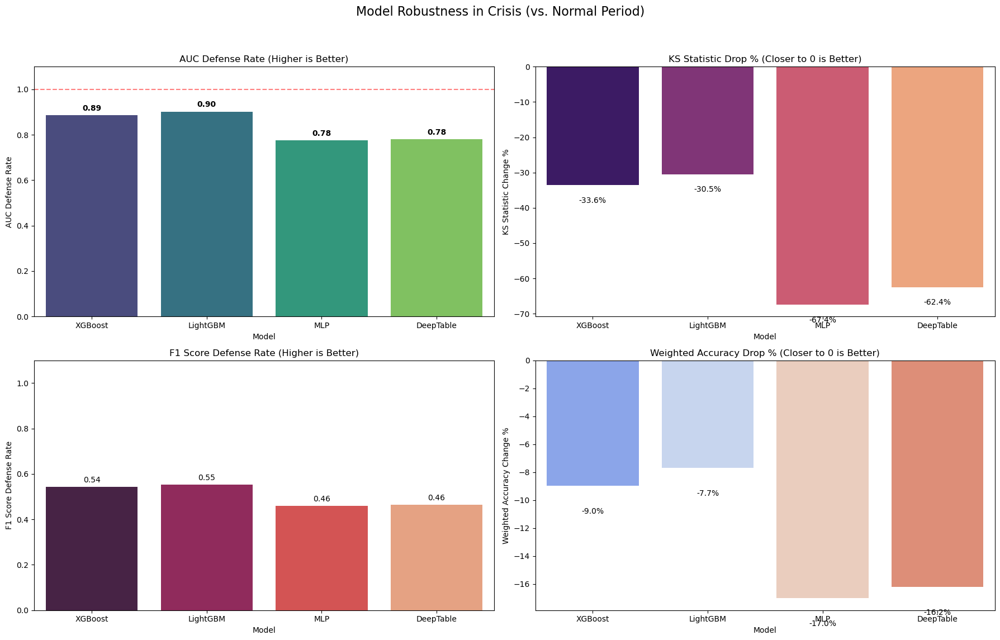
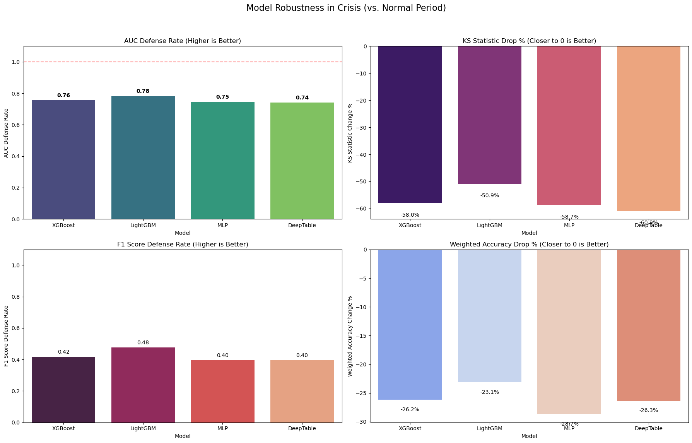

# Credit Risk Optimization and Robustness Analysis
### A Stress-Test Approach Using LendingClub Data

---

## Overview

This project studies **credit risk model robustness under regime shift** using LendingClub loan data (2007–2018).

Instead of relying solely on random train–test splits, we adopt a **stress-test framework**:
- Models are trained on **non-crisis (normal) periods**
- Performance is evaluated on the **2007–2009 Global Financial Crisis window**
- Tree-based gradient boosting models are compared against deep tabular learning approaches
- A controlled **data leakage experiment** is conducted using post-origination variables

The primary focus is **robust generalization**, not marginal in-sample performance gains.

---

## Key Findings

- Performance Saturation: Despite utilizing diverse architectures (Gradient Boosting vs. Deep Learning) and extensive hyperparameter tuning, all models converged to a similar AUC (≈ 0.72). This suggests that the predictive power is limited by the dataset itself (lack of macroeconomic variables), not the model choice.
- Performance drops consistently during the crisis period, indicating an out-of-distribution shift.
- Gradient boosting models show more stable behavior under stress than deep tabular models.
- Including post-loan variables inflates AUC to unrealistic levels (≈ 0.95).
- Model selection should prioritize robustness and calibration over peak metrics.

---

## Repository Structure
```bash
├── Final_project_Main.ipynb
│ └─ Main pipeline: preprocessing, model training,
│ normal-period evaluation, and crisis stress testing
│
├── Appendix_Data_Leakage_Analysis.ipynb
│ └─ Data leakage experiments using post-origination variables
│
└── README.md
```

---

## Dataset

- **Source:** LendingClub loan dataset (Kaggle)
- **Period:** 2007–2018
- **Task:** Binary classification (loan default)
- **Class distribution:** Strongly imbalanced

The dataset consists of high-dimensional tabular data with mixed numerical and categorical features.

---

## Problem Setup

### Normal vs Crisis Regimes

- **Normal period:** Loans issued outside the financial crisis window
- **Crisis period:** **December 2007 – June 2009**

Models are trained on normal-period data and evaluated on both normal and crisis-period test sets.

This setup mimics a realistic **credit risk stress-testing scenario**.

---

## Class Imbalance

### Default Rate Comparison


### Normal Period Distribution

### Crisis Period Distribution


Observed default rates during the crisis period are not higher than the normal period.  
This is likely due to stricter loan approvals and selection bias toward higher-quality borrowers.

---

## Models

The following models are evaluated:

- XGBoost
- LightGBM
- MLP with categorical embeddings
- Deep & Cross Network (Deep Table model)

### Training Details

- Hyperparameters tuned using **Optuna**
- Decision thresholds calibrated by **maximizing F1-score**
- Identical feature sets used across all non-leakage experiments

---

## Evaluation Metrics

- **AUC:** Ranking performance
- **KS statistic:** Separation between classes
- **PSI:** Population Stability Index (PSI > 0.25 indicates significant shift)
- **Weighted Accuracy:** Class-imbalance-adjusted accuracy
- **Threshold:** Optimal cutoff under the F1 criterion

---

## Results — Normal Period

### Performance Summary

| Model            | AUC | PSI      | KS Statistic | F1 Score | Recall | Weighted Accuracy | Threshold |
|------------------|-----|----------|--------------|----------|--------|-------------------|-----------|
| XGBoost          | 0.72 | 0.000243 | 0.32         | 0.45     | 0.66   | 0.66              | 0.51      |
| LightGBM         | 0.72 | 0.000197 | 0.23         | 0.45     | 0.60   | 0.60              | 0.48      |
| MLP + Embedding  | 0.72 | 0.000065 | 0.32         | 0.45     | 0.64   | 0.66              | 0.53      |
| Deep Table       | 0.72 | 0.000047 | 0.32         | 0.45     | 0.64   | 0.66              | 0.22      |

All models show comparable performance under stable conditions.

---

## Results — Crisis Stress Test

### Performance Under Distribution Shift

| Model            | AUC | PSI | KS Statistic | F1 Score | Recall | Weighted Accuracy | Threshold |
|------------------|-----|-----|--------------|----------|--------|-------------------|-----------|
| XGBoost          | 0.64 | 1.10 | 0.21         | 0.24     | 0.57   | 0.60              | 0.35      |
| LightGBM         | 0.65 | 1.33 | 0.23         | 0.25     | 0.60   | 0.61              | 0.31      |
| MLP + Embedding  | 0.56 | 1.57 | 0.10         | 0.20     | 0.85   | 0.55              | 0.22      |
| Deep Table       | 0.56 | 1.20 | 0.12         | 0.21     | 0.75   | 0.55              | 0.10      |


Performance degradation across all models confirms a strong **out-of-distribution effect**.
Gradient boosting methods exhibit relatively better stability.



---

## Data Leakage Experiment

Post-origination variables were intentionally included:
- `last_fico_range_high`
- `last_fico_range_low`

### Normal Period (With Leakage)

| Model            | AUC | PSI      | KS Statistic | F1 Score | Recall | Weighted Accuracy | Threshold |
|------------------|-----|----------|--------------|----------|--------|-------------------|-----------|
| XGBoost          | 0.95 | 0.000072 | 0.77         | 0.77     | 0.82   | 0.87              | 0.50      |
| LightGBM         | 0.95 | 0.000045 | 0.77         | 0.77     | 0.82   | 0.87              | 0.59      |
| MLP + Embedding  | 0.95 | 0.000031 | 0.77         | 0.77     | 0.84   | 0.87              | 0.67      |
| Deep Table       | 0.95 | 0.000062 | 0.77         | 0.77     | 0.82   | 0.87              | 0.41      |

### Crisis Period (With Leakage)

| Model            | AUC | PSI     | KS Statistic | F1 Score | Recall | Weighted Accuracy | Threshold |
|------------------|-----|---------|--------------|----------|--------|-------------------|-----------|
| XGBoost          | 0.72 | 0.64 | 0.32         | 0.32     | 0.42   | 0.64              | 0.32      |
| LightGBM         | 0.74 | 0.69     | 0.38         | 0.38     | 0.45   | 0.67              | 0.40      |
| MLP + Embedding  | 0.71 | 0.85     | 0.32         | 0.31     | 0.37   | 0.62              | 0.61      |
| Deep Table       | 0.70 | 1.06     | 0.30         | 0.31     | 0.48   | 0.64              | 0.22      |



These results are **not achievable in real underwriting** and illustrate the danger of feature leakage.

Details are provided in `Appendix_Data_Leakage_Analysis.ipynb`.

---

## Reproducibility

1. Download the dataset from Kaggle
2. Place the raw data in the expected directory
3. Run notebooks in the following order:
   1. `Final_project_Main.ipynb`
   2. `Appendix_Data_Leakage_Analysis.ipynb`
4. No GPU is required

---

## Limitations

- Crisis data reflects early-stage LendingClub loans
- Strong selection bias during the crisis period
- No macroeconomic variables included

---

## Future Work

- Incorporate macroeconomic indicators
- Evaluate additional stress periods
- Improve probability calibration
- Extend to survival or time-to-default modeling

---

## Conclusion

Across multiple strong baselines, performance clusters around AUC ≈ 0.72 under normal conditions.
Stress testing reveals that **robustness under distribution shift**, not peak accuracy, should guide model choice in credit risk modeling. This convergence indicates that we have likely reached the intrinsic limit (Bayes Error Rate) of the loan application data. Further improvements would require external features (e.g., real-time economic indicators) rather than more complex models.

